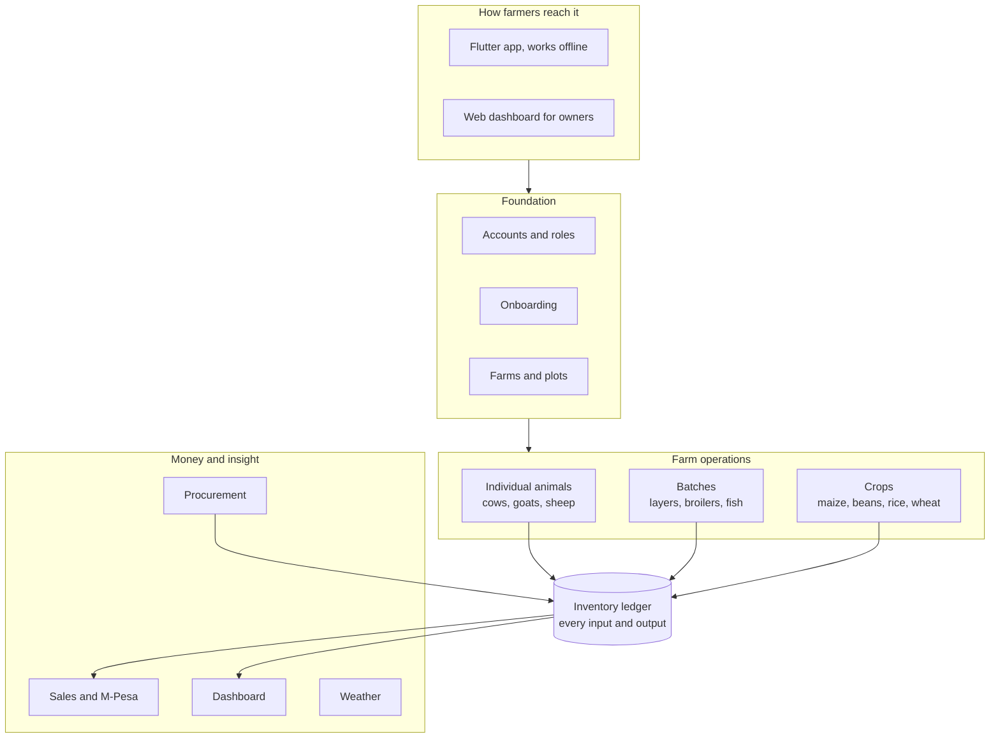

# Shamba OS — MVP Specification

**Version:** Draft 1 · **Date:** 29 September 2026 · **Stage:** SDLC Stage 2, Requirements

The Shamba OS MVP lets a semi-commercial smallholder on a mixed farm run their day-to-day records on a phone instead of a notebook, in Swahili or English, with or without signal, and see which part of the farm makes money.

---

## 1. Scope and decisions

### Decisions carried in from Stage 1

| Decision | Effect on the MVP |
| --- | --- |
| Primary segment: semi-commercial smallholders | The owner-operator is the main user; screens stay simple; farms are small but mixed |
| All listed problems in scope | Profit per enterprise, input costs, stock, debts and alerts all get MVP coverage, prioritised by MoSCoW |
| Pilot farms: mixed | Individual animals, batches and crops must work together on one farm |
| Swahili in MVP | Every farmer-facing screen, message and unit label in Swahili and English |
| Payroll in Phase 4 | No payroll; casual labour recorded as an expense only |
| Pricing set later; free tier | MVP free for pilots; plan limits built as feature flags, not enforced yet |
| Sales: demo-led and self-service | Self-service onboarding must work without help |
| Hosting: after legal review | Architecture must not assume a hosting region |
| Mobile: Flutter | Flutter app for field use; web dashboard for owners and managers |

### Gate status

Stage 1 gate: **conditional GO.** Question 8 (cost per farm) must be answered before this specification is signed off.

### In the MVP

- Phone sign-up, organisations, multiple farms, and roles for owner, manager and field worker
- Onboarding where farmers pick what they keep
- Plots with acreage and ownership or lease; structures
- Inventory ledger, suppliers and purchases
- Customers, sales, credit tracking and M-Pesa collection
- Basic finance: income, expenses and profit per enterprise
- Individual animals: dairy cows, beef cattle, dairy goats, sheep
- Batches: layers, broilers, fish
- Single-harvest crops: maize, beans, rice, wheat
- 7-day weather forecast per farm
- Offline Flutter app for field records; web dashboard
- Swahili and English throughout

### Explicitly out of the MVP

| Not in MVP | Planned for |
| --- | --- |
| Pigs and rabbits (mixed tracking pattern) | Phase 2 |
| Tomatoes, kales, bananas, avocados | Phase 2 |
| Full breeding and vaccination schedules | Phase 2 |
| NDVI crop health maps | Phase 2 |
| SMS and WhatsApp alerts (beyond login codes) | Phase 2, unless interviews move them earlier |
| AI alerts, questions and recommendations | Phase 3 |
| Soil and temperature monitoring | Phase 3 |
| Payroll and full accounting tools | Phase 4 |
| Vet, advisor and cooperative access | Phase 2 and Phase 4 |
| IoT sensors, markets beyond Kenya, partner API | Phase 4 |

---

## 2. MVP at a glance

The MVP is built in layers, from the foundation up. All farm operations write to one inventory ledger, and the money features read from it.

**Build order:** identity and tenancy → catalogue → farms, plots and structures → inventory ledger and finance → operations modules → money features and weather.

---

## 3. Personas

| Persona | Profile | Goals | Constraints | Role |
| --- | --- | --- | --- | --- |
| Owner-operator (primary) | Runs 1 to 10 acres with a few cows, poultry and maize or beans; sells to neighbours, traders and a local co-op | Know what earns money, stop losses, get paid on time | Low-end Android, limited data bundles, prefers Swahili, little time | Owner |
| Family helper or worker | Spouse, child or hired hand who milks, feeds and collects eggs | Record the day's work quickly | Shared phone, often offline, may have limited literacy | Field worker |
| Absentee owner or manager | Lives in town; farm run by a worker or relative | See what is happening without visiting | Checks in from a phone or laptop; needs to trust the records | Owner or manager |

Accountant, vet, advisor and cooperative personas are out of MVP scope.

---

## 4. Key user journeys

| ID | Journey | Persona | Steps | Success looks like |
| --- | --- | --- | --- | --- |
| J1 | Onboarding | Owner-operator | Pick language → phone and OTP → farm name and location → pick what you keep → quick counts → dashboard | First record entered within 10 minutes |
| J2 | Daily recording | Worker or owner | Open app offline → pick enterprise → enter milk, eggs, feed or deaths → save | A day's entries in under 2 minutes, no signal needed |
| J3 | Buy inputs | Owner-operator | Record purchase → choose supplier and item → quantity, unit, price → stock goes up | Stock level and cost update immediately |
| J4 | Sell and get paid | Owner-operator | Record sale → customer, product, quantity, price → M-Pesa request, cash, or credit | Stock goes down; payment or debt tracked |
| J5 | Plant and harvest a crop | Owner-operator | Choose plot → start season → record inputs and activities → record harvest → close season | Season profit shown on close |
| J6 | See how the farm is doing | Owner or absentee owner | Open dashboard → profit per enterprise → stock alerts → money owed | Answers "what is making money?" on one screen |

---

## 5. Functional requirements

Priorities follow MoSCoW: **Must**, **Should**, **Could**. Every requirement ID links to its design, code and tests.

### 5.1 Accounts and tenancy (ACC)

| ID | Requirement | Priority | Acceptance criteria |
| --- | --- | --- | --- |
| ACC-01 | Sign up and log in with a phone number and one-time code | Must | Code arrives by SMS; no email or password needed |
| ACC-02 | Create an organisation automatically at sign-up | Must | The owner never has to name or see an "organisation" |
| ACC-03 | Invite a worker by phone number with a role | Must | Invitee joins with access limited to that role and farm |
| ACC-04 | Roles: owner, manager, field worker | Must | Field worker cannot see money, prices or reports |
| ACC-05 | Remove a member | Must | Access ends immediately, including on their offline device at next sync |
| ACC-06 | Isolate every organisation's data | Must | Automated tests show no cross-organisation access on any endpoint |
| ACC-07 | Switch between organisations | Should | One login can belong to several organisations |

**Role summary**

| Role | Can do | Cannot do |
| --- | --- | --- |
| Owner | Everything: records, money, reports, members, settings | — |
| Manager | Day-to-day operations, stock, records and alerts for assigned farms | Manage billing or remove the owner |
| Field worker | Record milk, eggs, feed, deaths, treatments, activities and harvests | See prices, sales, profit or reports |

**Open questions**

- Should a shared family phone support quick user switching, such as a PIN per person, so records show who entered what?
- Can a farm have two owners, which is common with spouses or family land?
- How is an account recovered if the owner loses both phone and number?
- Can a worker without a smartphone record through the owner's phone?
- How does an account move safely to a new phone number?

### 5.2 Onboarding and catalogue (ONB)

| ID | Requirement | Priority | Acceptance criteria |
| --- | --- | --- | --- |
| ONB-01 | Choose language first | Must | Swahili or English applied before any other screen; changeable per person later |
| ONB-02 | Pick what you keep from picture tiles | Must | Covers all MVP types; multiple selection; "Other" free text |
| ONB-03 | Enter quick counts per pick | Should | Every question skippable |
| ONB-04 | Enable only picked modules | Must | Unpicked modules hidden in navigation and blocked in the API |
| ONB-05 | Add or remove types later from settings | Must | Same tile screen; removing hides a type but keeps its history |
| ONB-06 | Catalogue maintained as data | Must | New type, unit or product added in admin without an app release |

When onboarding finishes, the system switches on the picked modules, creates an enterprise for each type, loads its units and products, and links the farm location to the weather forecast. Farmers are never asked technical questions such as individual or batch tracking; the catalogue decides.

**Open questions**

- Should the first dashboard push one clear first action, such as "Record today's milk"?
- Should invited workers skip onboarding and land on their recording screen?
- What does a farmer see if they pick nothing, or only "Other"?
- Do the tile images need testing with farmers for recognition, for example local breeds?

### 5.3 Farms, plots and structures (FRM)

| ID | Requirement | Priority | Acceptance criteria |
| --- | --- | --- | --- |
| FRM-01 | Create one or more farms with name and location | Must | Location by GPS or map pin; county as fallback |
| FRM-02 | Add plots with name and acreage | Must | Acreage typed or calculated from a drawn boundary |
| FRM-03 | Draw plot boundaries on a satellite map | Should | Needed for NDVI in Phase 2 |
| FRM-04 | Record ownership or lease, with lease cost | Should | Lease cost charged to crops on that plot |
| FRM-05 | Add structures: shed, poultry house, pen, pond, store | Must | Animals, batches and stock can be placed in a structure |
| FRM-06 | View plot history | Should | Past seasons and yields listed per plot |

### 5.4 Inventory ledger (INV)

| ID | Requirement | Priority | Acceptance criteria |
| --- | --- | --- | --- |
| INV-01 | Record every stock movement: purchased, used, produced, sold, lost, transferred, corrected | Must | Each entry has item, quantity, unit, date, enterprise, reason and who recorded it |
| INV-02 | Show live stock levels per item and store | Must | Levels match the sum of movements |
| INV-03 | Support local units with conversions | Must | Bags, debes, crates, trays, litres, kg; a bag converts to a set weight per product |
| INV-04 | Correct mistakes by reversal, never by editing | Must | Original entry stays visible with its correction |
| INV-05 | Stock count with adjustment | Should | Difference recorded as a loss or gain |
| INV-06 | Low-stock alert | Should | Alert when an item falls below a farmer-set level |
| INV-07 | Transfer between enterprises | Should | For example maize stover to dairy, at zero or a set cost |
| INV-08 | Average cost per item | Must | Used stock is costed at the running average purchase price |

### 5.5 Individual animals: dairy cows, beef cattle, dairy goats, sheep (LIV)

| ID | Requirement | Priority | Acceptance criteria |
| --- | --- | --- | --- |
| LIV-01 | Register an animal with tag or name, type, sex, birth date, source, cost | Must | Animal appears in its herd and enterprise |
| LIV-02 | Record daily milk per animal or for the whole herd | Must | Either mode allowed; milk enters stock |
| LIV-03 | Record feeding for a herd | Must | Feed leaves stock and is costed to the herd |
| LIV-04 | Record treatments and vaccinations | Must | Date, product, dose note, cost; product leaves stock |
| LIV-05 | Record breeding events and births | Should | Service date, expected due date, offspring linked to its mother |
| LIV-06 | Record weights | Could | Weight history shown per animal |
| LIV-07 | Record sale or death | Must | Animal leaves the herd with reason and value |

### 5.6 Batches: layers, broilers, fish (BAT)

| ID | Requirement | Priority | Acceptance criteria |
| --- | --- | --- | --- |
| BAT-01 | Start a batch with type, count, date, source, cost, structure | Must | Batch count set from the starting number |
| BAT-02 | Daily record of feed, deaths and eggs on one screen | Must | Takes under 30 seconds; works offline |
| BAT-03 | Mortality alert | Should | Alert when a day's deaths exceed the batch's normal rate |
| BAT-04 | Vaccination reminders by batch age | Should | Editable schedule template per type, reviewed by a vet |
| BAT-05 | Sample weights for broilers and fish | Could | Average weight trend per batch |
| BAT-06 | Sell from a batch in its units | Must | Eggs by tray, birds by count or kg, fish by kg or piece |
| BAT-07 | Close a batch | Must | Shows total cost, revenue, profit, mortality rate, and feed per tray or per kg |

### 5.7 Crops: maize, beans, rice, wheat (CRP)

| ID | Requirement | Priority | Acceptance criteria |
| --- | --- | --- | --- |
| CRP-01 | Start a season on a plot with crop, variety, area, date | Must | Season becomes an enterprise |
| CRP-02 | Intercrop two crops on one plot | Should | Shared costs split by area share |
| CRP-03 | Record activities: land preparation, planting, weeding, spraying, fertilizing | Must | Inputs leave stock; hired labour and services recorded as costs |
| CRP-04 | Record harvest in bags or kg, green or dry | Must | Harvest enters stock |
| CRP-05 | Close a season | Must | Shows cost, revenue, profit, and yield per acre |

### 5.8 Sales and customers (SAL)

| ID | Requirement | Priority | Acceptance criteria |
| --- | --- | --- | --- |
| SAL-01 | Add customers with name and phone | Must | Customer reusable across farms in the organisation |
| SAL-02 | Record a sale of any product in its unit | Must | Stock leaves the ledger; revenue goes to the enterprise |
| SAL-03 | Take payment by M-Pesa request, cash, or credit | Must | M-Pesa confirmation marks the sale paid automatically |
| SAL-04 | Track money owed per customer | Must | Balance, age of debt, partial payments |
| SAL-05 | Send a simple receipt | Could | Shared by SMS or WhatsApp |

### 5.9 Procurement (PRO)

| ID | Requirement | Priority | Acceptance criteria |
| --- | --- | --- | --- |
| PRO-01 | Add suppliers | Must | Name and phone |
| PRO-02 | Record purchases | Must | Stock enters the ledger at the price paid |
| PRO-03 | Track money owed to suppliers | Should | Balance per supplier |

### 5.10 Finance (FIN)

| ID | Requirement | Priority | Acceptance criteria |
| --- | --- | --- | --- |
| FIN-01 | Record other expenses and income | Must | For example casual labour, transport, vet fees; assigned to an enterprise or the whole farm |
| FIN-02 | Profit per enterprise, farm and organisation | Must | Matches the ledger, expenses and sales for any date range |
| FIN-03 | Cost per unit produced | Must | Cost per litre, tray and kg, per enterprise |
| FIN-04 | Dashboard answering "what makes money?" | Must | One screen: profit per enterprise, money owed, stock alerts |
| FIN-05 | Export records | Should | Spreadsheet export of sales, expenses and stock |

### 5.11 Weather (WEA)

| ID | Requirement | Priority | Acceptance criteria |
| --- | --- | --- | --- |
| WEA-01 | 7-day forecast per farm location | Must | Rain and temperature, updated at least daily |
| WEA-02 | Store daily weather history per farm | Should | Kept for later yield analysis |
| WEA-03 | Heavy-rain warning | Could | Shown on the dashboard |

### 5.12 Offline and sync (OFF)

| ID | Requirement | Priority | Acceptance criteria |
| --- | --- | --- | --- |
| OFF-01 | Record daily entries offline | Must | Production, feed, deaths, treatments, activities, stock use |
| OFF-02 | Sync automatically when signal returns | Must | No duplicate records; user sees what is waiting to sync |
| OFF-03 | Resolve conflicts without losing data | Must | Both entries kept and flagged when two devices change the same item |
| OFF-04 | Keep each organisation's data separate on a shared phone | Must | Logging out or removal clears that organisation's local data |
| OFF-05 | Minimise data bundle use | Should | Sync sends only changes; images optional |

Sign-up, M-Pesa payments, weather and reports need a connection.

### 5.13 Language and localisation (LOC)

| ID | Requirement | Priority | Acceptance criteria |
| --- | --- | --- | --- |
| LOC-01 | Full Swahili and English interface | Must | Every farmer-facing screen, message and error |
| LOC-02 | Local units and KES currency | Must | Units from the catalogue; currency set per organisation |
| LOC-03 | Icons alongside text on recording screens | Should | Usable with limited literacy |

---

## 6. Non-functional requirements

Targets marked *(proposed)* are confirmed during design.

| ID | Area | Requirement | Target |
| --- | --- | --- | --- |
| NFR-01 | Tenant isolation | No organisation can read or change another's data | Zero failures in the isolation test suite on every release |
| NFR-02 | Security | Encrypted traffic and stored data; audit log of who changed what | All connections encrypted; audit log on every write |
| NFR-03 | Device performance | Runs smoothly on low-end Android phones | App opens in under 3 seconds on a 2 GB RAM phone *(proposed)* |
| NFR-04 | Network | Usable on slow 3G connections | A day's entries sync in under 30 seconds on 3G *(proposed)* |
| NFR-05 | App size and data use | Small download, light data use | Install under 30 MB; daily sync under 1 MB *(proposed)* |
| NFR-06 | Offline duration | Works offline for extended periods | At least 14 days of offline entries without loss *(proposed)* |
| NFR-07 | Availability | Server available for sync and payments | 99.5% monthly uptime *(proposed)* |
| NFR-08 | Scalability | Supports pilot and first-year growth | Target organisation count set from the cost model |
| NFR-09 | Usability | A new farmer succeeds without help | 8 of 10 test farmers complete onboarding and a first entry unaided |
| NFR-10 | Localisation | Full Swahili and English | No untranslated farmer-facing text |
| NFR-11 | Data protection | Complies with the Kenya Data Protection Act 2019 | Export and deletion on request; consent for any sharing |
| NFR-12 | Recoverability | Data can be restored after failure | Daily backups; restore tested monthly; data loss window under 24 hours |
| NFR-13 | Maintainability | Catalogue changes need no release | New type, unit or product live via admin |

---

## 7. Success metrics for pilot farms

Targets are proposals to confirm.

| Metric | Proposed target |
| --- | --- |
| Onboarding completed to first recorded entry | Within 10 minutes of sign-up |
| Farms recording at least 5 days a week | 70% after 4 weeks |
| Farms still active after 3 months | 60% |
| Owners viewing profit per enterprise | At least weekly |
| Decisions farmers attribute to Shamba OS | At least one per pilot farm in 3 months |
| Pilot farms willing to pay at a future price | 50% |
| Cross-tenant data incidents | Zero |

---

## 8. Validation and sign-off

### Validation plan

- [ ] Interview 15 to 20 smallholders on mixed farms, including absentee owners and workers who record
- [ ] Rank the problems by what farmers would pay to solve
- [ ] Test clickable prototypes of journeys J1, J2 and J4 in Swahili on low-end phones
- [ ] Confirm whether SMS or WhatsApp alerts must move into the MVP
- [ ] Confirm how phones are shared and literacy levels on recording screens
- [ ] Adjust priorities and acceptance criteria from findings

### Sign-off conditions

- [ ] All Must requirements reviewed and accepted
- [ ] Proposed NFR targets confirmed
- [ ] Cost per farm figures complete (Stage 1 gate question 8)
- [ ] Legal review of data protection obligations started
- [ ] Stage 3 design can begin with no open Must questions

### Traceability

Every requirement ID (ACC, ONB, FRM, INV, LIV, BAT, CRP, SAL, PRO, FIN, WEA, OFF, LOC, NFR) is linked to its journey, design element, code and tests. A requirement with no test is not done.